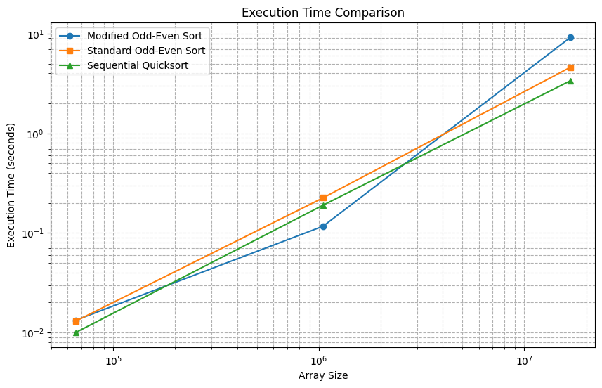
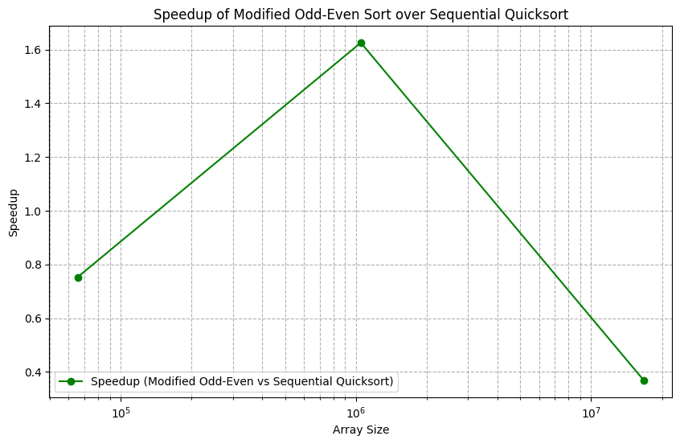

# Parallel Odd-Even Sort (MPI Implementation)

This project implements a **parallel version** of the **Odd-Even Transposition Sort** algorithm using **MPI** (Message Passing Interface).
It was developed as part of the **Parallel Computing** coursework at Wayne State University.

---

## Technologies Used

- **C++**
- **MPI (OpenMPI)**
- **Gnuplot** (for performance plotting)
- **Makefile** (for easy compilation)

---

## Project Description

- The program distributes a randomly generated array of integers across **8 MPI processes**.
- Each process sorts its assigned subarray using modified **Odd-Even Transposition** steps.
- The processes iteratively communicate and synchronize until the entire array is fully sorted.
- The sorted array is collected at **Process 0** and written into `result.txt`.
- Execution time is measured for:
  - Modified Parallel Odd-Even Sort
  - Standard Odd-Even Sort (parallel)
  - Serial Quicksort
- Performance analysis includes plots for **execution time** and **speedup**.

---

## How to Build

Clone the repository and navigate to the project directory:

```bash
git clone https://github.com/yourusername/Parallel-OddEven-Sort-MPI.git
cd Parallel-OddEven-Sort-MPI
```

Compile the code using the provided `Makefile`:

```bash
make
```

This will generate an executable, usually named `odd_even_sort` or as specified.

---

## How to Run

Run the program using `mpirun` or `mpiexec` with 8 processes:

```bash
mpirun -np 8 ./odd_even_sort
```

The program will:

- Generate 128 random integers
- Perform the parallel sorting
- Save the sorted array in `result.txt`
- Output logs to `output.txt`

---

## Performance Evaluation

- Tested with input sizes: 2¹⁶, 2²⁰, and 2²⁴ integers.
- Compared the execution times of three algorithms.
- Plotted Speedup vs. Number of Processes graphs using Gnuplot.

### Execution Time Comparison



### Speedup of Modified Odd-Even Sort over Sequential Quicksort



A detailed report can be found [here](docs/TermProjectReport.pdf).

---

## Project Structure

| File         | Description                                       |
| :----------- | :------------------------------------------------ |
| `main.cpp`   | Source code implementing parallel Odd-Even Sort   |
| `Makefile`   | Instructions to compile the project               |
| `result.txt` | Final sorted array output                         |
| `output.txt` | Log of execution steps                            |
| `report.pdf` | Detailed project report with performance analysis |

---

## Author

**Soumyadeep Chatterjee**

- [LinkedIn](https://www.linkedin.com/in/deep98/)
- [Portfolio](https://soumya98-dev.github.io/soumyadeepchatterjee.github.io/)
- [GitHub](https://github.com/Soumya98-dev)

---

## Notes

- This project was run and tested on a distributed environment (WSU Grid system).
- Make sure you have **OpenMPI** installed before compiling.
